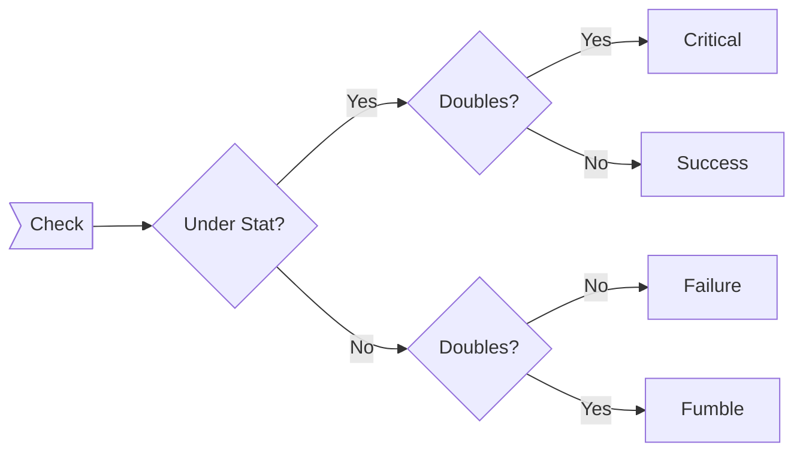
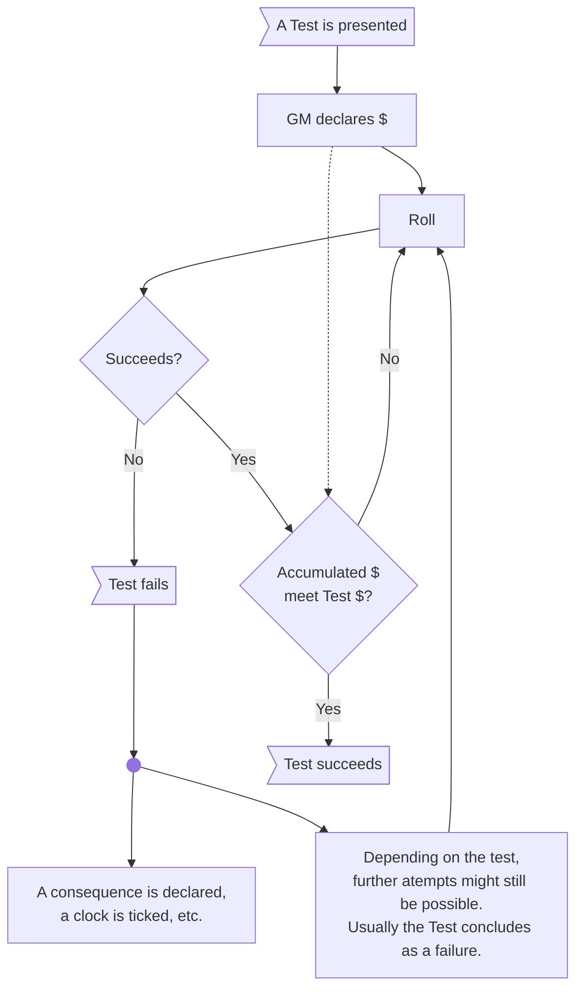

---
tags:
  - mechanics
  - core
aliases:
  - Test
  - Roll
  - Rolling the Dice
  - Tests
  - Rolls
  - Check
  - Checks
  - Advantage
  - Disadvantage
  - Position & Effect
abstract: Rolling 101, position & effect, advantage & disadvantage, difficulty
status:
  - untested
---
# Rolling the Dice
A roll is needed when a PC performs an action where success is not granted, and:
 - The PC is under stress.
 - The action is complicated.
 - The action's progress, quality or duration is a factor to be considered.

> [!danger] When not to roll
> Don't roll for actions which a specific PC should do easily, or when a failure would't result in an interesting complication.

 There are three types of rolls: Checks, Tests and Opposed Rolls.
> [!tip] Rolls in a nutshell
> - **Roll a d100 under or equal to a Stat** tosucceed.
> - **The Tier of Success ($)** is the **tens digit on a successful roll.**
> - **Check: pass or fail.** Tier ($) informs the quality of the success or the time it takes.
> - **Test:** checks until the **Tier ($) meets an arbitrary number** (Tier of the Test).
> - **Opposed Roll:** Rarely used. Useful for PvP situations.

> [!info] Some considerations:
> - This system **uses 00 and not 100** as a possible outcome of a dice roll.
> - **96 to 99** are always **failures.**
> - **Failure leads to negative consequences** in any roll.
> - Success Tiers can inform **roleplaying and mechanical consequences.**
## The roll
After **describing the action** a PC is performing and **select the Stat** that better represents that action, a player must roll a **d100.** The roll is successful if the outcome is **equal or under the selected Stat.**
### Tier of Success
> [!info] See more in [[tag-tier-system|Tier System]].

Whether a PC is performing a Check or a Test, the degree of effectiveness of their successes is measured by the **Tier of Success.**
- The **Tier of Success** is represented by the **$** symbol.
- On a successful roll, the **Tier of Success ($)** is the **tens digit** of the d100 die.
### Failure and consequences
A failure is a roll where the **outcome of the d100 is greater than the Stat** selected by the player. A failure might have direct or indirect consequences:
- Many **locations have [[Clocks]]** associated with them. **Each failure ticks a segment** of the clock. Once it is completed, a **negative event** happens.
- In other situations, failure might entail direct consequences. In [[combat]], a failure when dodging means a PC suffers an attack.
#### Criticals and Fumbles
- Doubles under the stat are **Criticals** (including 00).
- Doubles over a stat are **Fumbles**.

For criticals and fumbles, consult the tables [[crits-fumbles-tables]]

## The Check
The Check is the simplest roll. The outcome of a check is more or less **binary,** but the **Tier of Success still matters,** because checks are made against a **Check Tier.**
The check tier **is usually 1$,** where the PC only needs to succeed. Counting the resulting **Tiers of Success is still useful:**
- To assess the **magnitude** of the success.
- To determine the **duration** of the action.
- To represent the action within the **narrative.**

Sometimes, the **Check Tier** might be greater than 1$.
- The check only succeeds fully if equal or greater.
- Some **negative consequences might be avoided** if the roll succeeds (equal or under a Stat) but **doesn't meet the Check Tier**.

> [!info] About Check Tiers greater than 1
> Usually, the Checks where the needed Tier of Success is greater than 1 come from mechanics like Dodging in combat, where a character might need to roll $ equal or greater than the enemies' capability of attacking.
> 
> Calling for Checks with Check Tiers greater than 1 can be done in an improvised manner, but it is not a crucial part of the game.
## The Test
The test is a roll that measures the degree of completion of an action over time.
- The **Test Tier** is the Success Tier required to pass a Test.
- To fully succeed at a Test, the PC needs to accumulate a **Success Tier equal to the Tier of the Test.**
- The Success Tier **can be accumulated during several rounds** of play as long as the PC **doesn't fail.** ([[Rounds]])
- The Success Tier can also be **accumulated by several PCs** ([[Helping]]) if narratively appropriate.

### Failing a Test
If a **roll completely fails** (outcome is over the Stat), there are three possible outcomes:
- **Benevolent tests:** The test never fails. The Success Tier is saved even when a roll is failed, or the failures subtract Tiers of Success (without resetting the test).
- **Lost opportunity:** The test cannot be attempted again.
- **Test reset:** The test can be attempted again, but the accumulated Tiers of Success are lost.

> [!danger] Avoid players' frustration
>

#### Benevolent tests
This style of tests have less severe consequences:
- In some cases, the Test might be attempted an infinite number of times.
- In some cases, a failure might subtract Success Tiers.

> [!example]
> Gambling machine: pull the lever as many times as you want, if you pay.
>
> Honey pot: Try as many times as you want to put coins in your pockets, while being shot each turn by enemies in the room.
#### Lost opportunity
In some cases, the Test is an **activity that can only be attempted once.** If it fails, the PCs loose the opportunity forever.
- Use this type of tests sparingly, and for optional content only.
- Try to have narrative elements that telegraph this volatile nature, so players know they only have one shot.
#### Test reset
Other option is to have a situation where, if the Test fails, it can be attempted again but starting all over.
#### Test clocks
For some tests, it might be interesting to have a [[Clocks|Clock]] tracking the number of failed rolls. A test completely fails if the [[Clocks|Clock]] is filled.

> [!tip] Mix and match
 > It is possible to create a test that has several clocks, and changes from a test reset type to a lost opportunity one. This means that **the Test resets the first few times it is failed, but not infinitely.**
### Countdown test
Fill a clock vs npcs that empty it

## Position & Effect
Position & Effect are two concepts introduced in *Blades in the Dark.* They describe any narrative element which has a mechanical consequence when a roll is made.

> [!info] Position & Effect in a nutshell
> The roll is negotiated before dice are thrown, determining:
> - What the players and GM **expected outcome** of the action is.
> - Physical & emotional **situation of the PCs.**
> - **External factors:** How the environment, obstacles and NPCs factor in the roll.
> - **Tags:** How equipment and other factors factor in the roll
> - What **possible outcomes** can happen, in broad strokes.

In order to roll a Check or a Test, a discussion must take place between all players at the table. The outcome of this discussion, however brief it is, must answer:
- ¿What does the player want their PC to do?
- ¿What does a success grant, in the eyes of the player?
- ¿What negative outcomes can a failure bring?
- ¿What factors are acting in favor or against the PC?

Knowing the answers to this questions mean using extra mechanics when rolling:

| Factor                                                      | Mechanic                  |
| ----------------------------------------------------------- | ------------------------- |
| Very relevant difficulty / advantage, not expressed by Tags | Advantage or Disadvantage |
| Item properties, PC traits, environmental factors           | Tags                      |
| Difficulty, length or duration of the task                  | $ needed                  |

### Success Tier needed
Within the discussion about Position & Effect, one of the most important mechanical elements to be determined is the Tier of Success. Although Checks may need more than 1$ too, it is especially vital for Tests.

| $   | Difficulty  | Use |
| --- | ----------- | --- |
| 1   | Very Easy   |     |
| 2   | Easy        |     |
| 3   | Normal      |     |
| 4   | Challenging |     |
| 5   | Hard        |     |
| 6   | Very Hard   |     |
| 10  | Masterful   |     |

### Advantage & Disadvantage
Specific situations might impose Advantage or Disadvantage on a roll. This represent a complication or difficulty which stands from the environment or the emotional situation.
- Imposing both advantage or disadvantage on a roll **cancel each other one to one.**
- Several Advantages or Disadvantages **can be stacked.**
- Advantage is denoted with **/+/** and a number in front (if more than 1).
- Disadvantage is denoted with **/-/** and a number in front (if more than 1).

> [!example]
> **2/+/** is a roll with **2 Advantages.**
> **/-/** is a roll with **1 Disadvantage.**
> A roll with 3/+/ and 2/-/ results in a roll with **/+/ (1 Advantage).**

> [!tip] When to use it
> Note that Advantage and Disadvantage **make any roll much more likely to succeed or fail, respectively:** Advantage and Disadvantage are modifiers to the roll before it is made, whereas tag bonuses are only applied when the roll succeeds.
> 
> Although advantage and disadvantage can stack, it is better to **consider well what is the most determinant factor in the roll.**
> Then, **see if a tag could better represent it,** and if the factor is so important that /+/ or /-/ is really needed.
#### Rolling with Advantage or Disadvantage.
1. The Player **rolls a number of times** equal to the /+/ or /-/.
2. The Player **picks one of the outcomes:**
	- The **worst** if rolling with **Disadvantage.**
	- The **best** if rolling with **Advantage.**
> [!info] Outcome hierarchy
> Regardless of the number:
> - A Critical Success is always better than a Success.
> - A Success is always better than a Failure.
> - A Failure is always better than a Critical Failure.

> [!example]
> When rolling **3/+/,** a player **rolls thrice** and obtains **96, 21, 11** for a stat with 43 points. The player **selects the 11 outcome,** as it is a **critical success.**
> When rolling **/-/,** a player rolls two d100 and obtains **77 and 94** for a stat with 50 points. Both are failures, but **the 77 is a critical failure,** so the player **must choose it.**
## Tags and Rolls
Depending on the type of [[tag-tier-system|tags]].......

| Type of tag | Function                                      |
| ----------- | --------------------------------------------- |
| Golden      | Roll with advantage / disadvantage            |
| Silver      | Roll under Stat + Bonus (depends on Tag Tier) |
| Any other   | Add $ after success ($ depends on tier)       |

## Rolls with Stats scores greater than 99
> [!danger] Here be dragons
> Rolls with Stat scores equal to 100 or over are rare. This rules are here to be used sparingly, and to create powerful enemies. If actual PCs get to this range, the game might be broken. Alternatively, a temporary effect could raise their Stats to this point for some rounds. But they should be back to mortal territory after that.

A roll with a Stat score greater than 99 can still fail, but the success is very powerful:
- Failure:
	- A 96-99 is still a failure.
	- 99 is a Fumble.
- Success:
	- A successful roll will be in the 00-95 range.
	- The Tier of the Success ($) is multiplied by the hundreds digit +1.

>[!info] Hundreds digit +1
> Characters don't easily get to this stratospheric Stat scores. In the odd chance they do, it usually will be reserved to the low hundreds range. This will mean doubling $.

> [!example]
> A roll of 21 under a Stat of 103 will mean 4 successes (2 from the 20 multiplied by 2: 1 from the hundreds of the Stat score, plus 1).
> 
> If a character had 345 on a stat, a roll of 92 would mean 32 successes (9 from the 90 multiplied by 4: 3 from the hundreds of the Stat score, plus 1).