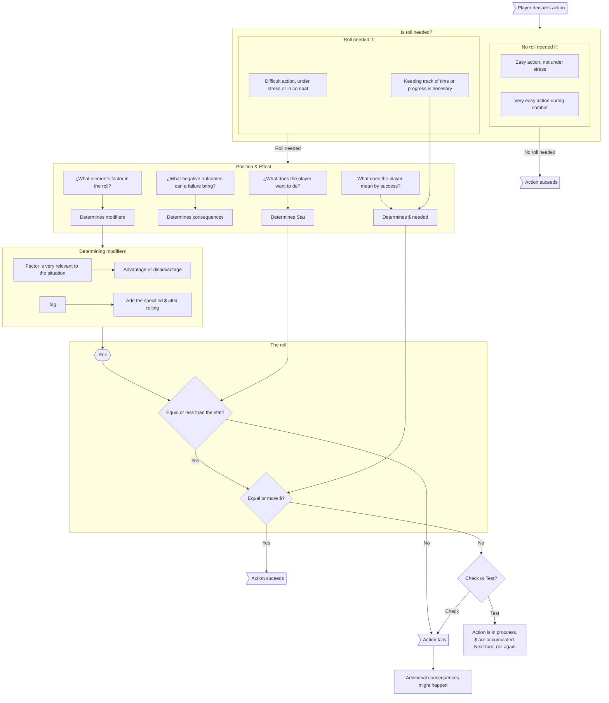

---
tags:
  - mechanics
  - hub
  - database
aliases:
  - System 101
  - Basic Mechaincs
abstract: System 101, hub for main mechanics
status:
  - wip
  - untested
---
# The Basic Mechanics
## PC Creation
> Check [[pc-creation]]

> [!info] The style of characters
> This system is mainly intended for players to run human or abhuman characters in a cool, grimdark, science fantasy setting.
> 
> The PCs are not very powerful at the beginning and they don't progress to heroic levels easily. Nonetheless, they can be resourceful and three-dimensional from the get-go.
## Order of play
> Check [[order-of-play]]

The game is always played in rounds. A round contains the turn for each character.
- During [[Exploration]], a round takes 5 to 10 minutes.
- During [[combat]], a round takes seconds. PCs get an action, and might reposition themselves.
- During [[downtime]], a round can take several days to a week.

The order of play can be determined by counting successes on an arbitrary roll, depending on the situation:
- Initiative roll: During combat, a number determined by the enemies must be beaten for each PC to act before the enemies.
- Out of combat, usually there is no need to determine the specific order the players act in. It can be useful and tidy to go clockwise around the table.
## PC Stats
> Check [[pc-stats]]

## Rolls
> Check [[rolling-dice]]

A roll is needed when a PC performs an action where success is not granted, and the PC is under stress, the action is complicated or the action's progress, quality or duration is a factor to be considered.

> [!tip] Rolls in a nutshell
> - **Roll a d100 under or equal to a Stat** tosucceed.
> - **The Tier of Success ($)** is the **tens digit on a successful roll.**
> - **Check: pass or fail.** Tier ($) informs the quality of the success or the time it takes.
> - **Test:** checks until the **Tier ($) meets an arbitrary number** (Tier of the Test).
> - **Opposed Roll:** Rarely used. Useful for PvP situations.

> [!info] Some considerations
> - This system **uses 00 and not 100** as a possible outcome of a dice roll.
> - **96 to 99** are always **failures.**
> - **Failure leads to negative consequences** in any roll.
> - Success Tiers can inform **roleplaying and mechanical consequences.**
## Tags
Check [[tag-tier-system|Tags]]

